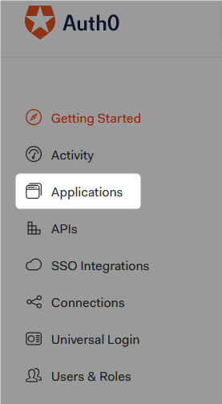

# Auth0 - Angular

Auth0 authentication and authorization module & Angular.  


:link: [Auth0](https://auth0.com/jp/)  
:link: [Angular](https://angular.jp/)  


## env 

* ng --version

```powershell
PS auth0-angular> ng --version

     _                      _                 ____ _     ___
    / \   _ __   __ _ _   _| | __ _ _ __     / ___| |   |_ _|
   / △ \ | '_ \ / _` | | | | |/ _` | '__|   | |   | |    | |
  / ___ \| | | | (_| | |_| | | (_| | |      | |___| |___ | |
 /_/   \_\_| |_|\__, |\__,_|_|\__,_|_|       \____|_____|___|
                |___/


Angular CLI: 12.0.3
Node: 14.15.0
Package Manager: npm 6.14.8
OS: win32 x64

Angular: 12.0.3
... animations, cli, common, compiler, compiler-cli, core, forms
... language-service, platform-browser, platform-browser-dynamic
... router

Package                         Version
---------------------------------------------------------
@angular-devkit/architect       0.1200.3
@angular-devkit/build-angular   12.0.3
@angular-devkit/core            12.0.3
@angular-devkit/schematics      12.0.3
@schematics/angular             12.0.3
rxjs                            7.1.0
typescript                      4.2.4
```


## 1. setup

### 1.1 Angular

```powershell
PS > ng new auth0-angular
? Would you like to add Angular routing? Yes
? Which stylesheet format would you like to use? SCSS   [ https://sass-lang.com/documentation/syntax#scss
      ]

PS >cd .\auth0-angular\
PS auth0-angular>
```

追加コンポーネントは適宜追加。

```powershell
PS auth0-angular>ng g s auth
PS auth0-angular>ng g c components/nav-bar
...
```

### 1.2 Auth0 Settings

  

  

  

  

Settings の内容にローカルテストの場合、次の項目をそれぞれ設定する。  

* Allowed Callback URLs : http://localhost:4200
* Allowed Logout URLs: http://localhost:4200
* Allowed Web Origins: http://localhost:4200


### 1.3 Angular Auth Service

Auth0 の Application の内容を設定する。  

[src/app/auth/auth.service.ts](src/app/auth/auth.service.ts):


```typescript
 14:      domain: '1 をコピー', // Domain
 15:      client_id: '2  をコピー', // Client ID
 16:      redirect_uri: 'http://localhost:4200' // ローカルテストの場合。
```
```typescript
120:      client_id: '2  をコピー', // Client ID
121:      returnTo: 'http://localhost:4200' // ローカルテストの場合。
```


  


---

:link: [Auth0 Angular SDK Quickstarts: Login](https://auth0.com/docs/quickstart/spa/angular?framed=1&sq=1#configure-auth0)  
